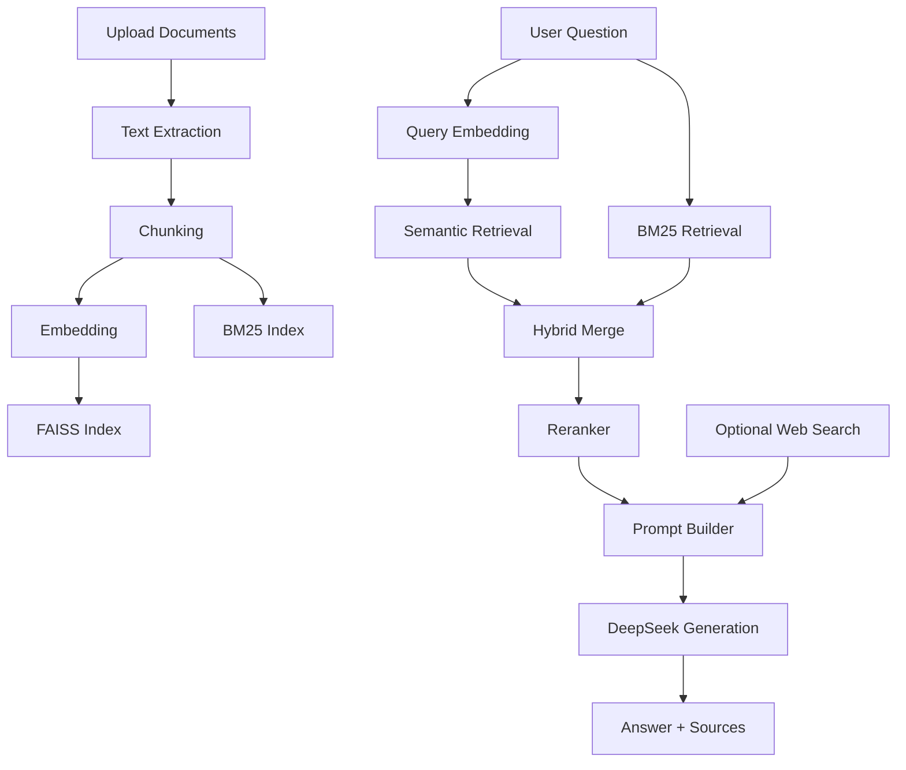

<div align="center">

# DocFlow

### A clean and practical Chinese RAG starter for document QA

一个面向中文场景的文档问答项目，聚焦把 RAG 的关键链路真正跑通：
**文档解析 -> 文本切分 -> 向量检索 -> BM25 混合召回 -> 重排序 -> 大模型生成**。

它不是“只有界面的 AI Demo”，也不是“只有算法的教学代码”。
这个仓库更像一个适合学习、演示、二次开发的 RAG 起点项目。

<p>
  
  
  
  
  
  
</p>

<p>
  
  
  
</p>

</div>

## ✨ TL;DR

如果你想找一个：

- 📄 能直接上传文档并开始问答的中文 RAG 项目
- 🧠 既能学原理，又能继续二开的工程化 Demo
- 🔍 不只做向量检索，还补上 BM25、重排序、递归检索这些关键环节的仓库

那这个项目会比较合适。

## 📚 Contents

- [Why This Project](#why-this-project)
- [Features](#features)
- [Use Cases](#use-cases)
- [Architecture](#architecture)
- [Quick Start](#quick-start)
- [API Example](#api-example)
- [Project Structure](#project-structure)
- [FAQ](#faq)
- [Roadmap](#roadmap)
- [Contributing](#contributing)

## 🚀 Why This Project

- **不是纸上谈兵的 RAG 教学仓库**：上传文档后即可完成分块、索引构建、检索和问答。
- **兼顾效果和可解释性**：不仅有向量检索，还加入了 BM25、重排序和分块可视化。
- **对中文场景友好**：集成 `jieba` 分词、中文文档处理链路和中文问答流程。
- **适合继续扩展**：内置 `Gradio UI + FastAPI API` 双入口，方便从 Demo 走向服务化。
- **代码结构清晰**：核心流程按 RAG 流水线拆分，阅读成本低，二开也舒服。

## 🌟 Features

| 能力 | 说明 | 价值 |
| --- | --- | --- |
| 多格式文档解析 | 支持 `PDF / TXT / MD / DOCX / XLS / XLSX / PPTX` | 能直接接入常见知识资料 |
| 混合检索 | `FAISS` 语义检索 + `BM25` 关键词检索 | 提升召回率，减少只靠向量检索的遗漏 |
| 二阶段排序 | 召回后使用交叉编码器进行精排 | 让最终上下文更贴近问题意图 |
| 递归检索 | 支持多轮查询改写与补充检索 | 更适合复杂问题和信息不足场景 |
| 联网搜索增强 | 可选接入 `SerpAPI` | 处理时效性问题时更灵活 |
| 文档分块可视化 | 在界面中查看 chunk 预览与详情 | 方便调参与理解检索效果 |
| 冲突检测 | 对多来源上下文做差异感知 | 减少“强行总结”的错误回答 |
| 双入口运行 | 提供 `Gradio` Web 界面与 `FastAPI` 接口 | 便于体验、集成和部署 |

## 👥 适合谁

- 想系统理解 RAG 基本链路的开发者
- 需要一个中文知识库问答原型的个人/团队
- 想把课程作业、毕业设计、内部工具做得更完整的同学
- 希望从“能跑”进一步走向“结构清晰、便于扩展”的工程实践者

## 🧩 Use Cases

- **企业内部知识库问答**：把产品文档、流程手册、FAQ 整理成可检索问答系统
- **课程设计 / 毕业设计**：比“调用一个大模型 API”更完整，也比纯论文复现更容易展示
- **垂直领域资料助手**：例如维修案例、技术规范、政策材料、培训文档
- **RAG 学习样板**：适合拆开每个模块理解检索增强生成的实际工程链路
- **原型验证**：在正式接入 Milvus、ES、Postgres 前，先验证业务问答流程是否成立

## 🏗️ Architecture



## ⚡ Quick Start

### 1. 克隆并进入项目

```bash
git clone git@github.com:quanthuyngoc987-star/docflow-rag.git
cd docflow-rag
```

如果你使用 HTTPS：

```bash
git clone https://github.com/quanthuyngoc987-star/docflow-rag.git
cd docflow-rag
```

### 2. 创建虚拟环境

Windows:

```powershell
python -m venv .venv
.venv\Scripts\activate
```

macOS / Linux:

```bash
python3 -m venv .venv
source .venv/bin/activate
```

### 3. 安装依赖

```bash
pip install -r requirements.txt
```

如果你希望处理 Excel 文件，建议额外安装：

```bash
pip install pandas
```

### 4. 配置环境变量

Windows:

```powershell
Copy-Item example.env .env
```

macOS / Linux:

```bash
cp example.env .env
```

最少需要配置：

```env
DEEPSEEK_API_KEY=your_api_key
DEEPSEEK_MODEL_NAME=deepseek-chat
```

可选配置：

```env
SERPAPI_KEY=your_serpapi_key
```

说明：

- ✅ 当前版本默认使用 **DeepSeek 云端模型**
- ♻️ 项目仍兼容旧变量名 `SILICONFLOW_API_KEY / SILICONFLOW_MODEL_NAME`
- 🌐 未配置 `SERPAPI_KEY` 时，联网搜索功能会自动不可用

### 5. 启动 Web UI

```bash
python rag_demo.py
```

默认会尝试在本地打开：

```text
http://127.0.0.1:17995
```

### 6. 启动 API 服务

```bash
python api_router.py
```

可用接口：

- `POST /api/upload`：上传文档并建立索引
- `POST /api/ask`：提交问题获取答案
- `GET /api/status`：查看服务与知识库状态

## 🔌 API Example

### 上传文档

```bash
curl -X POST "http://127.0.0.1:17995/api/upload" -F "file=@挖掘机维修案例(样例）.pdf"
```

### 发起问答

```bash
curl -X POST "http://127.0.0.1:17995/api/ask" -H "Content-Type: application/json" -d "{\"question\":\"这份资料里常见故障怎么排查？\",\"enable_web_search\":false,\"model_choice\":\"deepseek\"}"
```

## 🗂️ Project Structure

```text
.
├── rag_demo.py              # Gradio UI 主入口
├── api_router.py            # FastAPI 接口入口
├── config.py                # 配置中心与运行参数
├── core/
│   ├── document_loader.py   # 文档解析
│   ├── text_splitter.py     # 文本切分
│   ├── embeddings.py        # 向量化
│   ├── vector_store.py      # FAISS 向量索引
│   ├── bm25_index.py        # BM25 稀疏检索
│   ├── retriever.py         # 混合召回与递归检索
│   ├── reranker.py          # 重排序
│   └── generator.py         # Prompt 构建与答案生成
├── features/
│   ├── web_search.py        # 联网搜索增强
│   ├── conflict_detector.py # 多来源冲突检测
│   └── thinking_chain.py    # 推理内容格式处理
├── utils/
│   └── network.py           # 网络与端口工具
└── images/                  # 项目界面截图
```

## 💡 What Makes It Useful

### 1. 学习路径自然

代码按 RAG 的标准流水线拆分，没有把所有逻辑塞进一个脚本里。你可以顺着 `document_loader -> text_splitter -> embeddings -> retriever -> generator` 一路读下来。

### 2. 不只“能回答”，还尽量“答得靠谱”

项目不是简单做一个向量检索 Demo，而是补上了几个很关键的环节：

- `BM25` 补关键词召回
- `Reranker` 做二阶段排序
- `Recursive Retrieval` 做查询改写
- `Conflict Detection` 处理多来源信息差异

### 3. 可以从 Demo 快速走到原型

你可以直接用 Web UI 做演示，也可以通过 FastAPI 接到前端、机器人或内部系统里。

## ❓ FAQ

### 1. 这个项目适合直接上生产吗？

更适合学习、演示和业务原型验证。当前知识库在进程内存中，方便快速上手，但如果要上生产，建议补充持久化存储、权限隔离、日志监控和评测体系。

### 2. 为什么叫 DocFlow，但当前默认用了云端 DeepSeek？

`DocFlow` 强调的是文档流转与检索增强流程（Document Flow），不是限定“必须离线推理”。当前版本的知识来源主要是本地上传文档，生成阶段默认走 DeepSeek API，这样更利于快速体验和稳定输出。

### 3. 只做向量检索不行吗？

能跑，但效果通常不够稳。很多中文问答场景对关键词、专有名词、型号编号都比较敏感，所以项目补了 `BM25` 和 `Reranker`，这也是它比很多基础 Demo 更实用的地方。

### 4. 为什么有时候回答还是不够准？

RAG 的瓶颈通常不只在模型本身，还可能出在文档质量、文本切分、召回范围、重排序质量和上下文构造上。这个项目已经把关键链路拆开，方便你逐步定位问题。

### 5. 如果我想继续扩展，应该先改哪里？

比较推荐优先从这几块入手：

- 向量库持久化
- 文档元数据过滤
- 更强的 reranker
- 引用展示与答案评测
- Docker 化部署

## 📝 Notes

- ⏳ 首次运行会下载嵌入模型，速度取决于网络环境。
- 🧷 交叉编码器默认优先读取本地缓存；缓存不可用时会自动回退，不影响主流程运行。
- 📦 当前知识库保存在进程内存中，适合学习、演示和轻量原型，不适合直接作为生产级持久化方案。

## 🛣️ Roadmap

- [ ] 支持增量索引与持久化存储
- [ ] 增加评测脚本与检索效果对比
- [ ] 支持更丰富的文档格式与元数据过滤
- [ ] 提供 Docker 一键启动方案
- [ ] 增加多轮对话记忆与更细粒度引用展示

## 🤝 Contributing

欢迎提交 `Issue` 和 `PR`，无论是修复 bug、补充文档、改进检索效果，还是完善 UI 体验，都很有价值。

如果你准备继续扩展这个项目，比较推荐从下面几个方向入手：

- 持久化向量库与索引缓存
- 更强的 reranker 或重排策略
- 文档权限隔离与多用户知识库
- 更细的引用追踪和答案可解释性

简化的协作流程：

1. Fork 本仓库并创建功能分支
2. 提交清晰的 commit 信息（建议按功能点拆分）
3. 提交 PR，并在描述中写明改动动机和验证方式
4. 对 review 意见做增量修改，不强制 squash 历史

## 📄 License

本项目采用 [MIT](LICENSE) 许可证。
