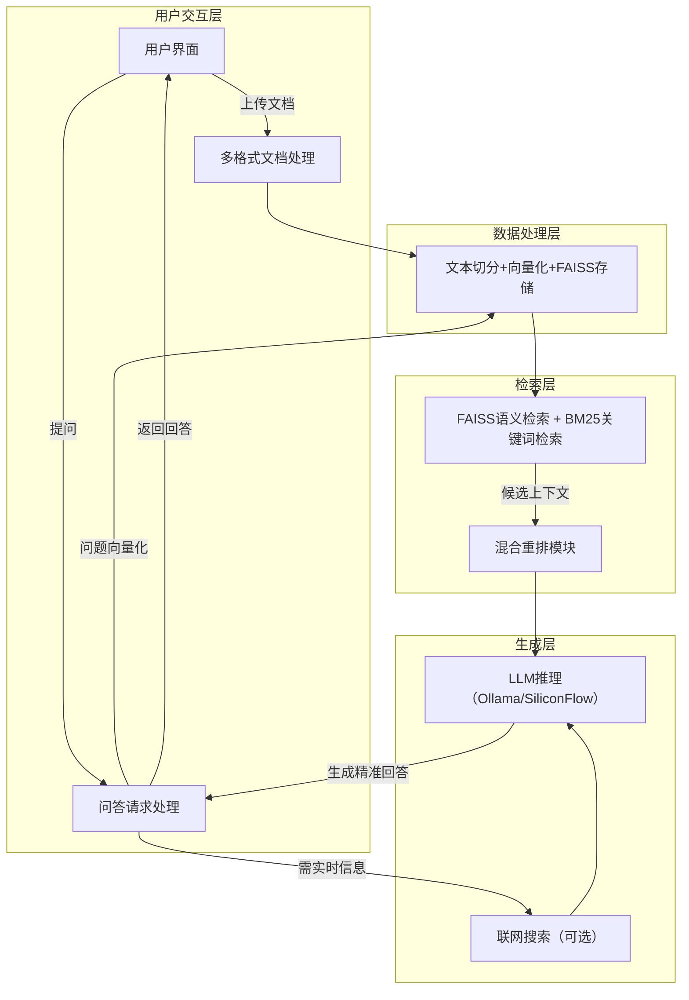

<div align="center">

# 本地化智能问答系统 (FAISS版) - 从零搭建可落地的RAG工程实践

🔥 无需复杂配置，手把手拆解RAG全链路，本地部署+云端适配，新手也能快速上手的工程化实践项目

## 🎯 核心学习目标

告别RAG理论空谈，聚焦「可动手、可落地」，帮你从0到1掌握检索增强生成核心技术，构建属于自己的智能问答系统。

* **拆解RAG黑盒** ：亲手实现「文档加载→文本切分→向量化→检索→生成」全流程，理解每一步核心逻辑
* **掌握技术选型** ：实战FAISS向量检索与BM25关键词检索混合策略，理解不同检索方式的适配场景
* **优化实战技巧** ：通过交叉编码器重排序、递归检索，手把手提升RAG系统的准确性和召回率
* **多模型适配** ：无缝集成本地Ollama与云端SiliconFlow API，掌握本地轻量化与云端高性能的灵活切换

## 🌟 核心功能 | 开箱即用

| 功能模块                                                                            | 核心亮点                                                      |
| ----------------------------------------------------------------------------------- | ------------------------------------------------------------- |
| ----------------------------------------------------------------------------------- |                                                               |
| 📁 多格式文档处理                                                                   | 支持PDF/TXT/DOCX/MD等8种格式，自动分割、向量化，无需手动处理  |
| -                                                                                   | -                                                             |
| 🔍 混合检索引擎                                                                     | FAISS语义检索+BM25关键词检索，双重保障，大幅提升检索准确性    |
| 🔄 智能重排序                                                                       | 支持交叉编码器、LLM精排，过滤无效信息，让回答更精准           |
| 🌐 联网增强（可选）                                                                 | 集成SerpAPI，补充实时网络信息，解决静态文档时效性问题         |
| 🗣️ 本地+云端双引擎                                                                | 自动检测可用LLM，本地Ollama轻量部署，云端SiliconFlow免GPU压力 |
| 🖥️ 交互式UI                                                                       | 基于Gradio构建，简洁直观，支持文档分块可视化，便于调试学习    |

## 📂 项目结构 | 按RAG流水线拆分（新手友好学习路线）

项目按「RAG核心流程」拆分模块，建议按顺序学习，循序渐进掌握每一个环节：

```bash

├── config.py                 # ⚙️ 配置中心（环境变量、超参数、LLM自动检测，一键配置）
├── rag_demo.py               # 🖥️ 主入口（Gradio UI启动，一键运行）
├── api_router.py             # 🔌 REST API路由（可选，支持接口调用）
│
├── core/                     # 🧠 RAG核心模块（重点学习！按流水线顺序）
│   ├── document_loader.py    # 1️⃣ 文档加载 — 多格式文本提取，解决不同文档解析问题
│   ├── text_splitter.py      # 2️⃣ 文本分块 — 长文本智能切分，优化检索效果
│   ├── embeddings.py         # 3️⃣ 向量化 — 文本转向量，理解语义映射逻辑
│   ├── vector_store.py       # 4️⃣ 向量存储 — FAISS索引，高效检索核心
│   ├── bm25_index.py         # 5️⃣ 稀疏检索 — BM25关键词检索，补充语义检索短板
│   ├── retriever.py          # 6️⃣ 混合检索 — 语义+关键词融合，提升召回率
│   ├── reranker.py           # 7️⃣ 重排序 — 精排检索结果，过滤无效信息
│   └── generator.py          # 8️⃣ 生成回答 — Prompt优化+LLM调用，输出高质量回复
│
├── features/                 # ✨ 扩展功能（按需学习，提升项目竞争力）
│   ├── web_search.py         # 联网搜索（SerpAPI集成，实时信息补充）
│   ├── conflict_detector.py  # 矛盾检测，提升回答可信度
│   └── thinking_chain.py     # 思维链处理（DeepSeek-R1适配，复杂问题拆解）
│
└── utils/                    # 🔧 工具模块（辅助功能，无需深入，会用即可）
    └── network.py            # HTTP请求+端口检测，保障服务稳定
  
```

## 🔧 系统架构 | 可视化理解RAG全流程



## 🚀 快速上手 | 3步启动服务（新手必看）

### 1. 环境准备（Python 3.9+ 必选）

推荐使用虚拟环境，避免依赖冲突，复制命令直接执行即可：

#### 方式一：venv（推荐，跨平台）

```bash

# Mac / Linux
python3 -m venv rag_env
source rag_env/bin/activate

# Windows
python -m venv rag_env
rag_env\Scripts\activate
  
```

#### 方式二：Conda（可选，适合数据分析从业者）

```bash

conda create -n rag_env python=3.10 -y
conda activate rag_env
  
```

### 2. 安装依赖+配置环境

```bash
# 安装核心依赖
pip install -r requirements.txt

# 配置环境变量（复制示例配置，填入API密钥）
cp example.env .env
# 编辑.env文件，至少配置一项LLM后端：
# - SILICONFLOW_API_KEY: 云端引擎（推荐，无需GPU）
# - 或后续启动本地Ollama服务（无需API密钥）
  
```

### 3. 启动服务（本地/云端二选一）

#### 选项1：使用本地Ollama（推荐，轻量化，无需联网）

```bash

# 1. 下载Ollama（MacOS直接执行以下命令，其他系统访问官网）
curl -fsSL https://ollama.com/install.sh | sh
# 2. 启动Ollama服务
ollama serve
# 3. 拉取模型（示例：deepseek-r1:8b，轻量且效果好）
ollama pull deepseek-r1:8b
# 4. 启动项目
python rag_demo.py
  
```

#### 选项2：使用云端SiliconFlow（无需本地GPU，直接可用）

```bash
# 确保.env文件中配置了SILICONFLOW_API_KEY
python rag_demo.py
  
```

服务启动后，会自动在浏览器打开 `http://127.0.0.1:17995`，首次运行会自动下载向量化模型（约80MB，耐心等待）。

## 📦 核心依赖清单（按功能分层，清晰易懂）

* **用户交互层** ：gradio（快速搭建交互式Web界面）
* **数据处理层** ：pdfminer.six（PDF提取）、langchain-text-splitters（文本切分）、sentence-transformers（向量化）、faiss-cpu（向量检索）、jieba（中文分词）
* **检索与外部调用** ：requests、urllib3（HTTP请求）、rank_bm25（BM25检索）
* **系统辅助** ：python-dotenv（环境变量）、psutil（系统监控）、numpy（向量计算）
* **可选扩展** ：fastapi、uvicorn（REST API服务）

## 🚀 进阶扩展方向（提升竞争力，适合进阶学习）

基于本项目，可进一步探索以下方向，打造更具实用性的RAG系统：

1. **多跳检索与推理链** ：处理复杂问题，实现多次检索-推理循环（难度：困难）
2. **多模态适配** ：集成图像、表格等多模态内容，扩展检索范围（难度：中等-困难）
3. **检索质量自优化** ：通过LLM评估检索结果，自动调整检索策略（难度：困难）
4. **用户反馈持续学习** ：利用用户反馈，动态调优模型和检索参数（难度：困难）
5. **智能缓存与增量索引** ：优化性能，支持文档增量更新，减少重复计算（难度：中等）

## 🤝 贡献与交流

本项目面向开发者、学习者开放，欢迎大家：

* 🌟 Star 本项目，支持开源发展
* 💬 提交Issue，反馈问题或提出建议
* 🔧 提交PR，贡献代码（优先修复bug、优化文档、新增实用功能）

## 📝 许可证

本项目采用 **MIT License** 开源协议，可自由用于个人学习、商业项目（注明出处即可）。

✨ 祝大家学习顺利，快速掌握RAG核心技术，构建属于自己的智能问答系统！ ✨
